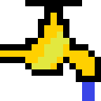

# SpigotNotifier [](https://chrome.google.com/webstore/detail/spigot-notifier/dpkibifcklglomemgflhamcdohfobfpd?hl=en)[](https://chrome.google.com/webstore/detail/spigot-notifier/dpkibifcklglomemgflhamcdohfobfpd?hl=en)
> Google Chrome Extension


Receive alerts and messages notifications for your Spigot account at given intervals.

## Getting Started

Install the extension from Google Webstore, it's free and you're ready to go. The extension will not ask you for your credentials, or any other sensitive information. 
The extension does work with 2FA authentication out of the box, sit back, relax, receive notifications as they come.

## Contributing

If you'd like to contribute, you're more than welcome to. Create a pull request with your code and I will validate. Simple to follow rule is to follow the layout of the libraries, if you're adding new features, test them firmly and don't forget to update the manifest, see versioning below.

## Versioning

For versioning, the project orientates around [SemVer](http://semver.org/). Please follow the given format.

## License

This project is licensed under the GNU3 License - see the [LICENSE.md](LICENSE.md) file for details.

## Development/Porting API

Currently, the API consists of several features which, when and if porting for another XenForo forum, could be used to speed up the porting process. 
Open the v2Manager.js file. Inside you'll find 'priv' (private) object which contains 'XHRSite' property, that's the URL of the forum the requests will be made against and also the base URL that will be used to handle navigational events. 
When requests are made, there are 4 events which will be triggered. Those events are (Format: DOM - Event): 

* #alerts - SN:AlertUpdate
* #messages - SN:MessageUpdate
* #ratings - SN:RatingsUpdate
* #posts - SN:PostCountUpdate

They are binded to their representive DOM elements. 
To handle them (if needed to process further logic) we can listen to them the usual way we implement event listeners in JQuery, for example: 

```
$("#alerts").on("SN:AlertUpdate", function(event){

    if (event.count > 0) {
        $(this).css("color", "#D6847B");
    } else {
        $(this).css("color", "");
    }
    $(this).text(event.count + " new");
});
```

For full implementation example, please see Content/Scripts/v2Popup.js. If you have any questions or require help, don't be afraid to open a new issue here, just make sure you label it correctly, I will reply as soon as I can.

## Notes

If you ported the extension, I would love to hear from you so I could make a list here with active ports. I like to see how my initial creation is being used. 
While not necessary, you would be awesome to give credit for my work in your ported version, in all means it is a free product and you're free to use it as you please, but recognition for myself would be neat :).

If you would like to see a new feature, create a new 'Issue' and label it accordingly. 